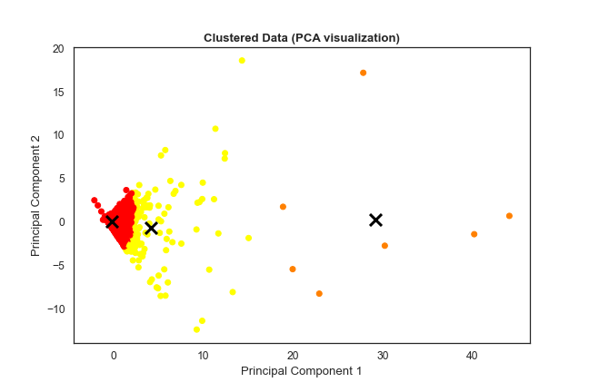

# Insiders - All In One Place

This is the repo of the Insiders project from the All In One Place company.
 
# Project
- In this project, I defined the best customers, from the All In One Place company, eligible to be part of a loyalty program, called Insiders.
- From the database of the company, I structured, cleaned and analysed the datasets using pandas and numpy, created charts that generated insights with matplotlib and seaborn, clustered the customers with K-Means algorithm into 3 groups:
   - Normal Customers
   - High Value Customers (included in Insiders)
   - Highest Value Customers (included in Insiders)

  

# Repository
- csv - The folder with all csv files used
- images - The folder with all images files used in this repo

# Stack 
- Pandas
- Numpy
- Matplotlib
- Seaborn
- Scikit-Learn
